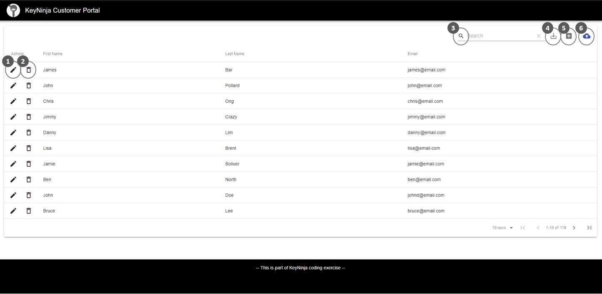
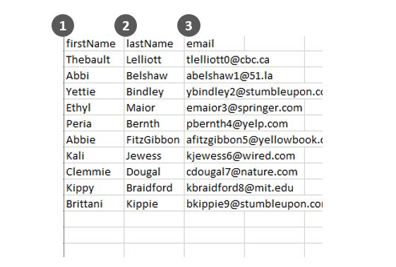

## Attempt at Building a Simple Customer Data Portal

The app is currently deployed here: [KeyNinja Customer Portal](https://secret-refuge-96688.herokuapp.com/)

### Demo

#### Features

1. `Edit` customer data
2. `Delete` customer data
3. `Search` for customer data
4. `Download` customer data to CSV file
5. `Add` new customer data
6. `Batch upload` customer data using CSV file

**Note:** When doing the `batch upload`, users must strictly follow the below format:

**Headers**

1. `firstName`
2. `lastName`
3. `email`

---